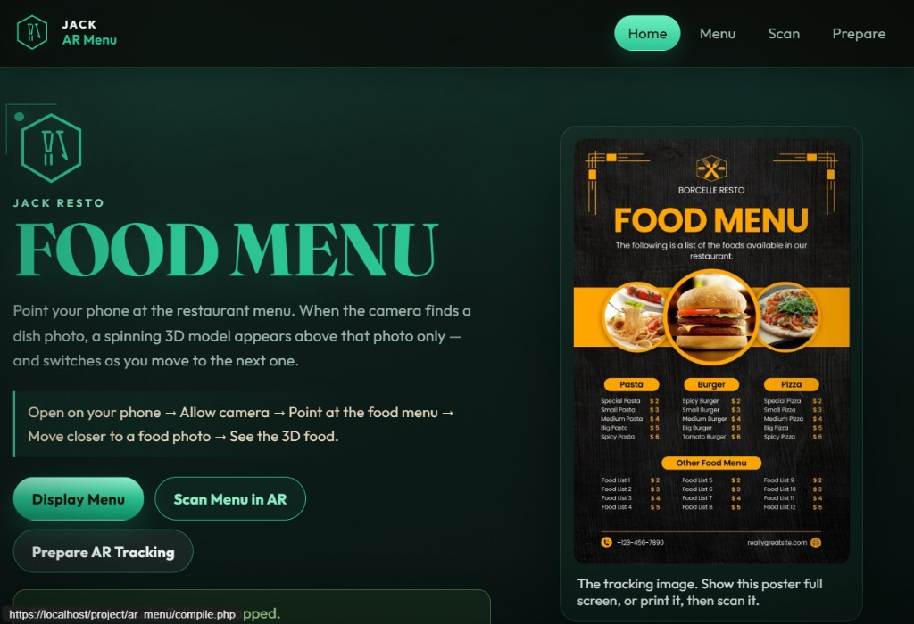
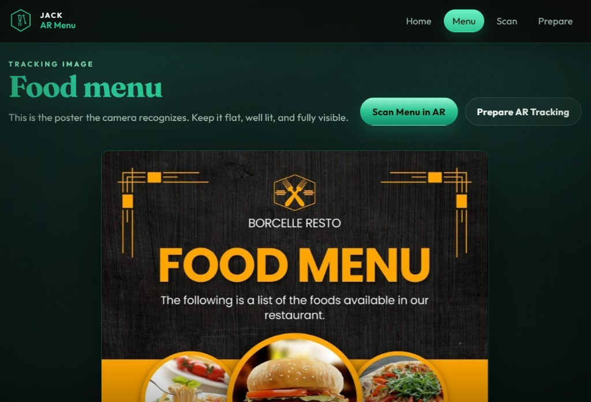
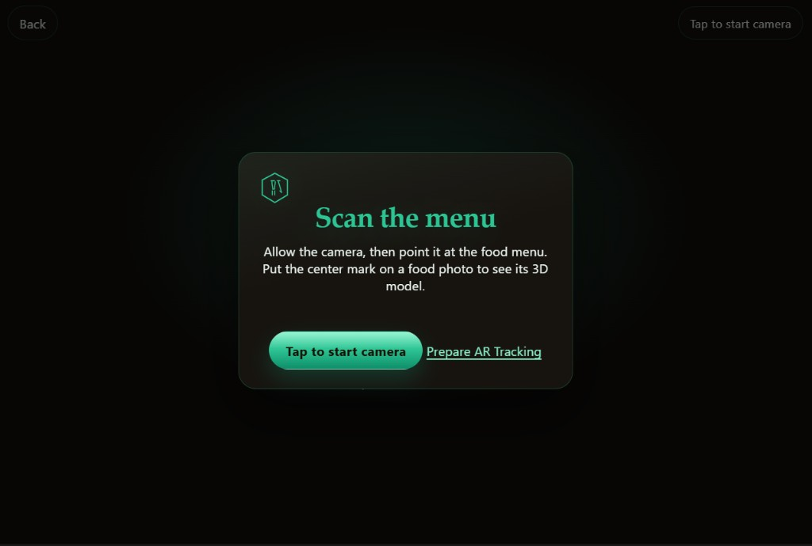
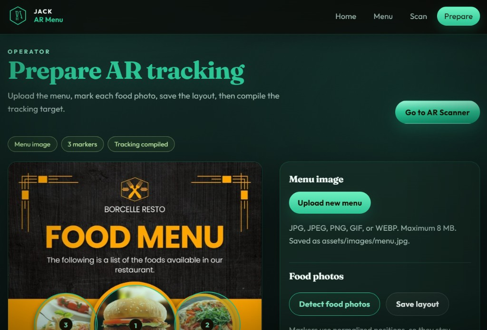

# Jack Resto · Web AR Food Menu

Browser-based AR food menu. Guests open the site on a phone, point the camera at the menu poster, and a spinning 3D dish appears above the food photo they aim at — no native app install.

Built with PHP 8+, HTML/CSS/Vanilla JS, Three.js, and MindAR image tracking. Runs on XAMPP (Windows) and cPanel-style shared hosting.

---

## Quick start (XAMPP)

1. Place the project in `C:\xampp\htdocs\project\ar_menu`
2. Start **Apache** in XAMPP (MySQL is not required)
3. On your PC open: **http://localhost/project/ar_menu/** (use `http`, not `https://localhost`)
4. Open **Prepare AR Tracking**, confirm the menu image and dish markers, then Detect / Save / Compile if needed
5. Test AR on PC: **http://localhost/project/ar_menu/ar.php** → Tap to start camera
6. Test AR on a phone: you need an **HTTPS** public or tunnel URL (see Phone / HTTPS below)
7. Change brand name and QR base URL in `includes/config.php`

---

## Features

- Home page with menu preview, flow instructions, and QR code for the AR page
- Display Menu — full poster view for screen or print scanning
- Scan Menu in AR — camera + MindAR image target + one visible 3D dish at a time
- Prepare AR Tracking — upload menu, auto-detect food photos, drag markers, assign food types
- Save layout as JSON (`assets/targets/layout.json`)
- Compile MindAR target in-browser (`assets/targets/menu.mind`)
- Built-in low-poly 3D foods (burger, pizza, pasta, chicken, salad, juice, and more)
- JSON PHP APIs for upload / layout / target save (no Laravel / React)
- Mobile-friendly UI; phone AR works best over HTTPS

---

## Screenshots

| Home | Display Menu |
|:---:|:---:|
|  |  |

| AR Scanner | Prepare AR Tracking |
|:---:|:---:|
|  |  |

---

## Folder structure

```
ar_menu/
├── index.php              Home
├── menu.php               Display menu poster
├── ar.php                 AR scanner
├── compile.php            Prepare tracking (operator)
├── api/
│   ├── layout.php         GET dish layout JSON
│   ├── upload.php         POST menu image
│   ├── save-layout.php    POST marker layout
│   └── save-target.php    POST compiled .mind file
├── assets/
│   ├── css/app.css
│   ├── images/menu.jpg    Tracking poster
│   ├── js/                AR, compile, foods, layout, QR
│   ├── targets/           layout.json + menu.mind
│   └── vendor/            Three.js + MindAR
├── includes/
│   ├── config.php         Brand + public base URL
│   ├── helpers.php
│   ├── header.php
│   └── footer.php
├── docs/screenshots/      README screenshots
├── tools/                 Optional local HTTPS tunnel helpers
├── LICENSE
└── README.md
```

---

## 1. XAMPP setup

1. Copy the project to `C:\xampp\htdocs\project\ar_menu`
2. Start **Apache** in XAMPP Control Panel
3. Open: http://localhost/project/ar_menu/
4. Edit branding in `includes/config.php` if needed:

```php
const APP_BRAND = 'Jack Resto';
const APP_NAME = 'AR Menu';
const APP_TITLE_SUFFIX = 'Jack Resto';
const APP_PUBLIC_BASE = ''; // empty = auto from current host
```

5. PHP **GD** should be enabled (for converting uploaded PNG/WEBP/GIF to `menu.jpg`)
6. Use desktop Chrome / Edge for **Compile tracking** (needs WebGL)

Typical local URLs:

| Page | URL |
|------|-----|
| Home | http://localhost/project/ar_menu/ |
| Menu | http://localhost/project/ar_menu/menu.php |
| AR | http://localhost/project/ar_menu/ar.php |
| Prepare | http://localhost/project/ar_menu/compile.php |

> Tip: In Cursor’s built-in browser, always use `http://localhost/...`. `https://localhost` often shows `ERR_CERT_AUTHORITY_INVALID`.

---

## 2. Prepare the menu (operator)

Open **Prepare AR Tracking** (`compile.php`):

1. **Upload new menu** — JPG / PNG / GIF / WEBP, max 8 MB → saved as `assets/images/menu.jpg`
2. **Detect food photos** — canvas-based region detection (or click the poster to add markers)
3. Set each marker’s food type (Burger, Pizza, Pasta, … or Ignore)
4. Drag circles to fine-tune position; adjust radius / scale if needed
5. **Save layout** → `assets/targets/layout.json`
6. **Compile tracking target** → `assets/targets/menu.mind` (keep the tab open; can take up to ~1 minute)
7. **Go to AR Scanner** to test

Only the dish you aim at should show its 3D model; aiming at another photo switches models. Models slowly rotate.

---

## 3. Phone / HTTPS

Mobile browsers need a **secure context** for the camera.

| How you open the site | Camera / AR |
|-----------------------|-------------|
| `http://localhost` on the PC | Works |
| `http://172.x.x.x` on the phone | Usually blocked |
| Self-signed `https://IP` | Certificate warning; often awkward on iPhone |
| Real **HTTPS** domain (cPanel / Cloudflare) | Works like a production site |

For phone QR codes, set a reachable HTTPS base in `includes/config.php`:

```php
const APP_PUBLIC_BASE = 'https://your-domain.com/ar_menu';
```

Optional local tunnel (temporary public HTTPS while Apache is running):

```bat
tools\start-https-tunnel.bat
```

Then put the printed `https://….trycloudflare.com/project/ar_menu` value into `APP_PUBLIC_BASE`, refresh Home, and scan the new QR.

---

## 4. Upload to cPanel

Use **HTTPS** on the live host (not plain HTTP) so phones can open the camera.

1. Upload the project folder (e.g. `public_html/ar_menu` or a subdomain)
2. Enable SSL (Let’s Encrypt) for the domain
3. Ensure `assets/images` and `assets/targets` are writable by PHP
4. Set:

```php
const APP_PUBLIC_BASE = 'https://your-domain.com/ar_menu';
```

5. Open the HTTPS Home page, re-check Prepare → Compile if you replaced the poster
6. Scan the Home QR on a phone → Allow camera → Point at the menu

No MySQL required. No Node backend required.

---

## 5. System flow

1. Operator uploads / displays the menu poster
2. Operator marks each food photo and compiles the MindAR target
3. Guest opens Home (or scans the QR) on a phone
4. Guest allows the camera and points at the full menu
5. When the poster is tracked, aiming at one food photo shows that dish’s 3D model
6. Moving to another photo switches the model; only one model is visible at a time

---

## Requirements

- PHP 8.3+ recommended (8.x with GD)
- Apache (XAMPP or cPanel)
- Modern Chrome / Edge / Safari
- HTTPS for real phone AR
- WebGL for compiling the tracking target on a computer

---

## Security notes

- `includes/` is blocked from direct web access via `.htaccess`
- Uploaded images are validated (type / size) and always saved as `menu.jpg` (original filename is not trusted)
- Prefer HTTPS in production
- Do not commit temporary tunnel URLs as your permanent production base URL

---

## License

This project is licensed under the [MIT License](LICENSE).
